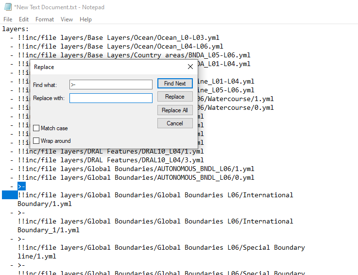
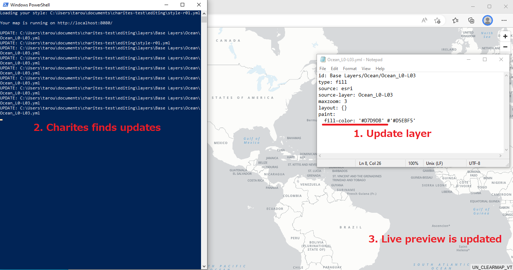
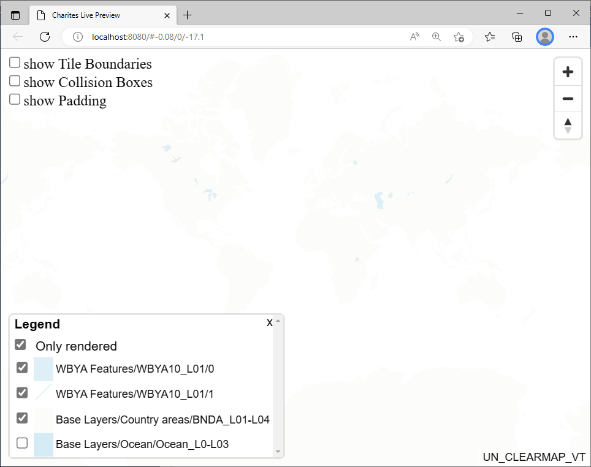
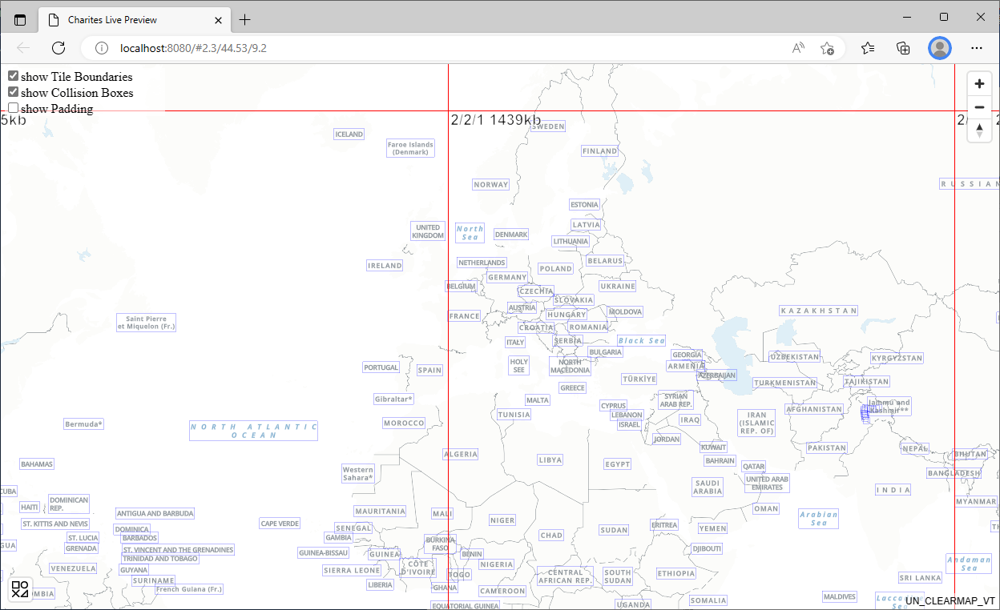
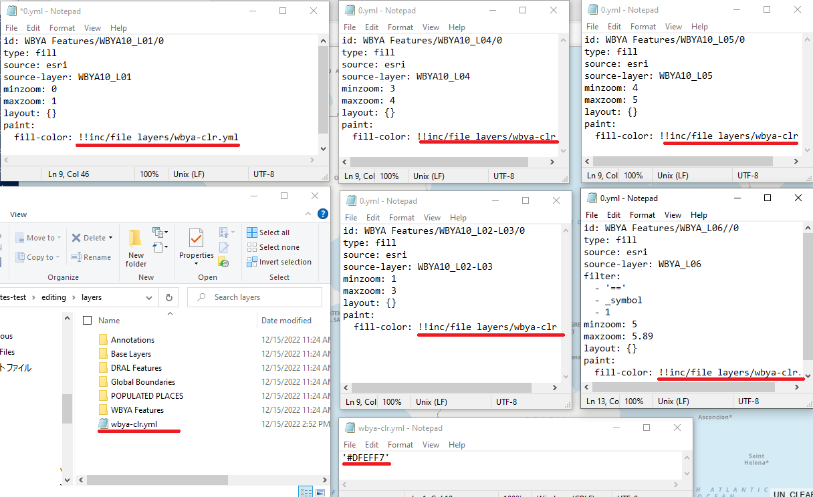

Example 2: Import existing style.json and edit it with charites
===================================================================
This is an example of using charites for importing an existing style.json and editing it as yaml files, and exporting them back to a json style. 

Condition
------------------------
- OS: Windows 10
- Charites version: 0.3.0
- Running on WindowsPowershell

Steps
-----

Step 1. Import style json into a series of YAML files
^^^^^^^^^^^^^^^^^^^^^^^^^^^^^^^^^^^^^^^^^^^^^^^^^^^^^^^^^^^

If your style json is in the Internet, it may need to downloat it from the Internet before you convert because charites cannot directly convert json a file in the Internet. Use curl.exe (in WindowsPowershell) or curl (in bash environment).

.. code-block:: 

    curl.exe -O https://ubukawa.github.io/cmv-test/style1.json
    charites convert style1.json editing/style.yml

Then, you will see a series of yaml files are converted from the source json. You will obtain an overall YAML that contains a list of style layers with the style yamls in the layer directory.  
In this case, we will have "style.yml" in "editing" directory together with a lot of yaml files for layers in "layers" directory.

.. image:: ./img/example02-001.png
   :scale: 75%
   :align: center

.. image:: ./img/example02-002.png
   :scale: 75%
   :align: center

(Tips) It is good to know that if your source json has some folder structure in its layer ids, that structure would be maintained when you import. 

.. image:: ./img/example02-005.png
   :scale: 75%
   :align: center

.. image:: ./img/example02-003.png
   :scale: 75%
   :align: center

.. image:: ./img/example02-004.png
   :scale: 75%
   :align: center

Step 2. Checking an overall yaml (style.yml in this case)
^^^^^^^^^^^^^^^^^^^^^^^^^^^^^^^^^^^^^^^^^^^^^^^^^^^^^^^^^^^
Check the style.yml by opening it with Notepad or any text editor. You will see it like this:

.. image:: ./img/example02-006.png
   :scale: 75%
   :align: center

Although it is not often seen, we need to check one thing. Sometimes, if id for each layer is too long, YAML automatically uses ">-" and break the line to improve human's readability. ">-" would pretend an actual line break in YAML, however, it will cause some problem for Charites, so please fix line brakes with ">-" in the layers if you find them.
This is often seen in style files from Esri vector tile because it has detailed folder structure sometimes.

.. image:: ./img/example02-007.png
   :scale: 75%
   :align: center

.. image:: ./img/example02-008.png
   :scale: 75%
   :align: center

You can extract layers and use "replace" tool to remove ">-" and unnecessary line changes.

.. image:: ./img/example02-010.png
   :scale: 75%
   :align: center

If you obtain the list of layers without ">-", you are ready to go to the next step.

.. image:: ./img/example02-011.png
   :scale: 75%
   :align: center

.. note::

    You may also need to check paths in "sprite", "glyphs" and "sources." They would be written as relative paths, so you may need to adjust these paths so that charites in your local PC can access to them. In addition, if you are importing styles from ArcGIS server, reference to the source should be modifyed (use "tiles" instead of "url"). The "tiles" URL will be provided by adding "/tile/{z}/{y}/{x}.pbf" in the end of Esri vector tile server URL.

Step 3. Serve YAML files for live preview
^^^^^^^^^^^^^^^^^^^^^^^^^^^^^^^^^^^^^^^^^^

Run the "charites serve" command to serve your YAML files in the localhost. By default, its port is 8080.

.. code-block:: 

    charites serve editing/style.yml

A window would automatically appears in the windows environment, but if not please open "http://localhost:8080" to access your live view. You can stop the live preview by pressing ctrl + c.

.. image:: ./img/example02-012.png
   :scale: 75%
   :align: center

Step 4. Editing YAML files to change style
^^^^^^^^^^^^^^^^^^^^^^^^^^^^^^^^^^^^^^^^^^^^^
You can change/edit the map style by editing YAML files. If you edit and save your update, charites automatically finds your updates to reflect them into the live view.

Here are some tips for efficient style editing.

(Tips 1) Legend control
########################
There is a legend control in the lower left of the screen. You can turn on/off any layers so that your edit would be easy. It will also help you to identify layers that should be edited.
You can enlarge the window by clicking the button, and reduce its size by clicking "x" in the window. You can also choose to list only rendered layers or not in the window. 

(Tips 2) Showing tile boundary
###############################
It would be alos helpful to show the tile boundary. There are checkbox in the upper left, and you can turn on/off. You will see tile border and its xyx in z/x/y order together with tile size. This would be useful when you also think about optimization of your vector tile.

(Tips 3) Showing collision boxes
#################################
It would be alos helpful to show the collision boxes. If a box is red, it indicates a collision with others. When you adjust label location/size, this is good.

.. image:: ./img/example02-015.png
   :scale: 75%
   :align: center

(Tips 4) Use of "#" (comment tag) to specify error
###################################################
If there is a layer contains some error, the web map may not appears. In such a case, use a YAML comment tag "#" to comment out a layer (or layers) to specify the layer contains an error. The comment tag is also useful to tentatively change colors, etc.

(Tips 5) Use of inclusion of other YAML file for efficinet edit
################################################################
If you repeatedly use the same expression (color, font, etc) for several layers, it is conveninet to use a reference to a common expression. You can do it by using inclusion of  an independent YAML file with "!!inc/file hogehoge.yml". This is particular important if you manage your style with YAML files.

.. image:: ./img/example02-017.png
   :scale: 75%
   :align: center

Step 5. Exporting style json from YAML files
^^^^^^^^^^^^^^^^^^^^^^^^^^^^^^^^^^^^^^^^^^^^^^^
Once you have edited your style with YAML files, you can now export it back to json by running the following command.

.. code-block:: 

    charites build editing/style.yml out.json

Congratulations. You will obtain the updated style json, and all done.

